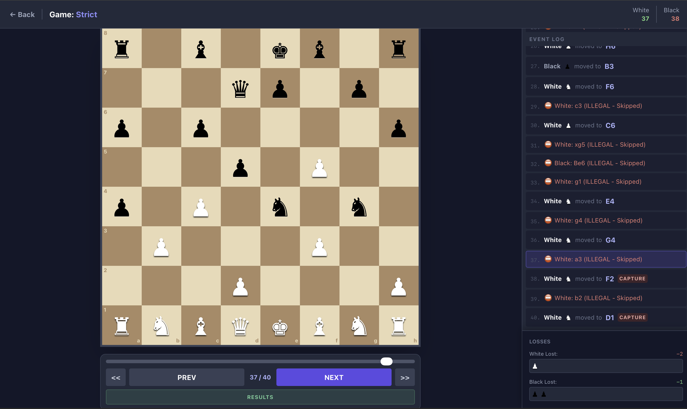

# Blind Chess

**Blind Chess** is a unique, solitaire-style variation of chess where players record their moves independently without seeing the opponent's pieces. The game relies on prediction, intuition, and "phantom" attacks. Once both sides have recorded their moves, the game is simulated in a central engine to determine the winner based on logic and conflict resolution rules.

## 🎮 How It Works

The game consists of two distinct phases: **Recording** and **Play Mode**.

### Phase 1: The Recorder
1.  **Choose a Side:** Player 1 selects White, Player 2 selects Black (or one player plays both sides in isolation).
2.  **Blind Play:** You see your own pieces, but the opponent's pieces are completely hidden.
3.  **Phantom Captures:** Since you cannot see the enemy, you must guess their location to capture them.
    *   *Pawns:* You are allowed to make diagonal capture moves onto empty squares if you believe an enemy piece is there.
    *   *Other Pieces:* You simply move to the square you want to attack.
4.  **Export:** Once finished, download your move list as a text file (`white.txt` or `black.txt`).

### Phase 2: Play Mode (Simulation)
1.  **Load Files:** Upload both `white.txt` and `black.txt` into the engine.
2.  **Select Logic Mode:** Choose how the engine handles impossible moves (see below).
3.  **Watch the Battle:** The engine attempts to execute the moves from both lists turn-by-turn.
4.  **Result:** The winner is decided by Checkmate or a Score system (Material + Checks) if the move lists run out.

## ⚔️ Simulation Rules

When the two "realities" are merged, conflicts will occur (e.g., trying to move a piece that was captured by the hidden opponent three turns ago).

### Conflict Resolution Modes
*   **Mode 1 (Strict):** If a move is illegal (e.g., piece is gone, path blocked), the turn is **skipped**. The player loses their chance to act for that turn.
*   **Mode 2 (Smart Search):** If a move is illegal, the engine ignores it and immediately searches for the **next legal move** in that player's list. This ensures players always make a move if possible.

### Scoring
If the game does not end in Checkmate, the winner is determined by points:
*   **Pawn:** 1 point
*   **Knight/Bishop:** 3 points
*   **Rook:** 5 points
*   **Queen:** 9 points
*   **Check:** 10 points (Bonus)
*   **Checkmate:** 500 points (Instant Win)

## 🚀 Getting Started

### Prerequisites
*   Node.js installed
*   npm or yarn

### Installation

1.  Clone the repository:
    ```bash
    git clone https://github.com/your-username/blind-chess.git
    ```
2.  Navigate to the directory:
    ```bash
    cd blind-chess
    ```
3.  Install dependencies:
    ```bash
    npm install
    ```

### Running the App

Start the development server:

```bash
npm run dev
```

Open [http://localhost:3000](http://localhost:3000) to view it in the browser.

## 🛠️ Tech Stack

*   **Frontend:** React 19, TypeScript
*   **Styling:** Tailwind CSS
*   **Logic:** Chess.js (Rules and FEN handling)
*   **Build Tool:** Create React App / Vite (depending on setup)
